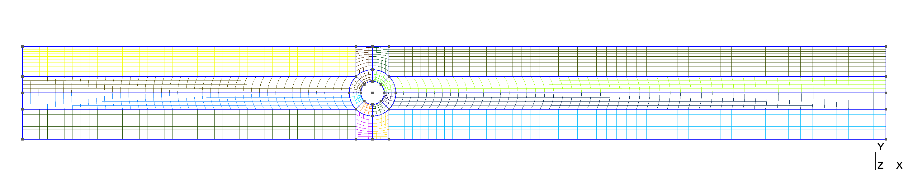

# Incompressible flow past a cylinder in a channel

Configuration is similar to Bouchut et al. though cylinder location is bit different.

Create mesh

```shell
gmsh -2 cyl.geo
```

This shows the grid



Run steady solver

```shell
./main -p cyl.prm -steady
```

Run unsteady solver

```shell
./main -p cyl.prm -unsteady
```

Run unsteady solver starting from steady solution

```shell
./main -p cyl.prm -unsteady -restart
```
