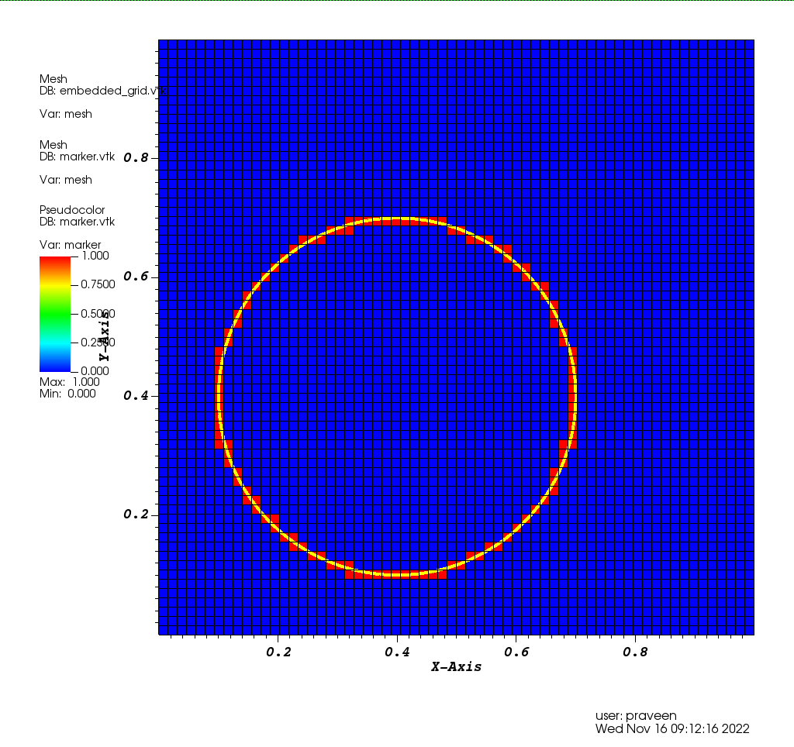
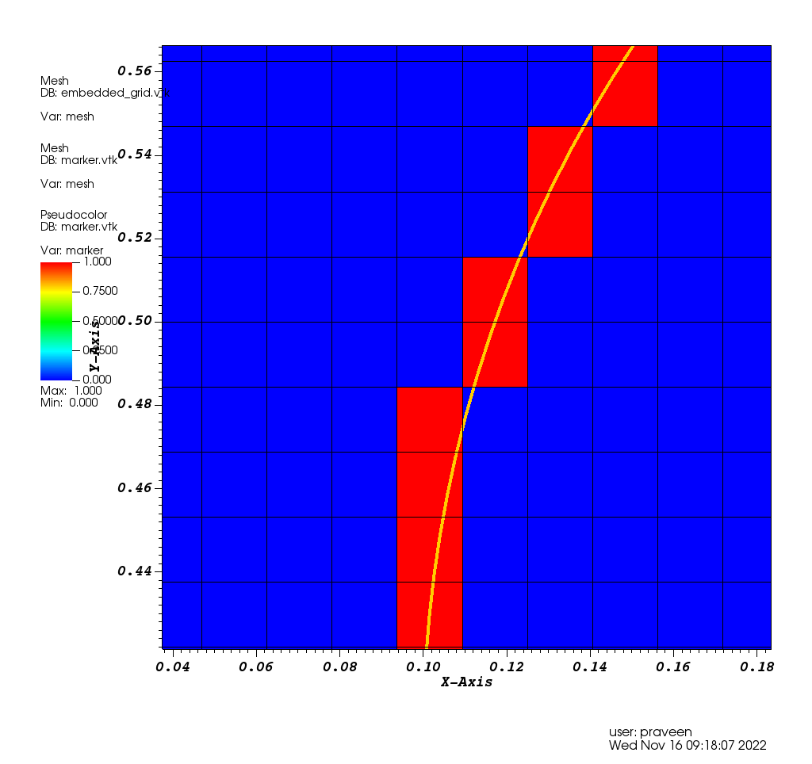

# Marks cells cut by an embedded curve

Uses ideas from step-60 of deal.II tutorials.

WARNING: Does not mark all cells properly.

We make a grid on the curve and find in which cells these grid points lie and
mark them. But this can miss some cells if the curve-grid is coarser than the
space-grid.

After running code, plot these two files: `embedded_grid.vtk` and `marker.vtk`.

