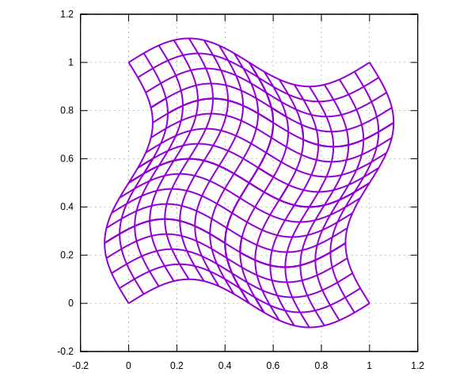

## MappingFEField

Create a map of original grid to a curved grid using `FE_Q` and `MappingFEField`. The map is taken from Arpit's thesis, Section 8.7.2.2.

In this example, an explicit map is used, but it could also be obtained by solving some PDE; we do this in Winslow and elasticity examples.

```shell
make
./demo
gnuplot plot.gnu
open *.svg
```

## Original grid


## Mapped grid, using degree = 2


